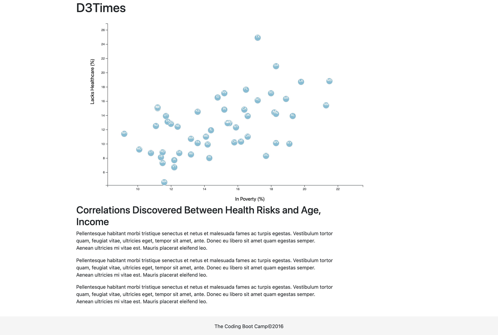

# D3 Homework - Data Journalism and D3

## Background

Welcome to the newsroom! You've just accepted a data visualization position for a major metro paper. You're tasked with analyzing the current trends shaping people's lives, as well as creating charts, graphs, and interactive elements to help readers understand your findings.

The editor wants to run a series of feature stories about the health risks facing particular demographics. She's counting on you to sniff out the first story idea by sifting through information from the U.S. Census Bureau and the Behavioral Risk Factor Surveillance System.

The data set included with the assignment is based on 2014 ACS 1-year estimates from the [US Census Bureau](https://data.census.gov/cedsci/), but you are free to investigate a different data set. The current data set includes data on rates of income, obesity, poverty, etc. by state. MOE stands for "margin of error."

## The Task

### Core Assignment: D3 Dabbler

 A scatter plot was created between  `Healthcare vs. Poverty`.

Using the D3 techniques we learned in class, a scatter plot that represents each state with circle elements was created. The code for the above can be found in  [`app.js`](https://github.com/Kpearson72/D3-Challenge/blob/main/D3_data_journalism/assets/js/app.js) file in D3__data_journamlism directory under [D3-Challenge](https://github.com/Kpearson72/D3-Challenge) github repository. I used the `d3.csv` function to read the data: [`data.csv`](https://github.com/Kpearson72/D3-Challenge/blob/main/D3_data_journalism/assets/data/data.csv). The final result is the scatterplot found below.

Requirements:
* Include state abbreviations in the circles.

* Create and situate your axes and labels to the left and bottom of the chart.

* Note: You'll need to use `python -m http.server` to run the visualization. This will host the page at `localhost:8000` in your web browser.

- - -

### [Bonus: Impress the Boss](https://github.com/Kpearson72/D3-Challenge/tree/main/D3_data_journalism_BONUS)
Check out the github [D3 Times Page](https://kpearson72.github.io/D3_data_journalism_BONUS/)

#### 1. More Data, More Dynamics

Included are more demographics and more risk factors:
1. Placed additional labels in the scatter plot and give each click events so that users can decide which data to display.
   
2.  Animated transitions for circles' locations as well as the range of each axes. This was done for each risk factors for each axis.

#### 2. d3-tip - toolTip

Added tooltips for all circles and display each tooltip with the data that the user has selected. Use the `d3-tip.js` plugin developed by [Justin Palmer](https://github.com/Caged)—we've already included this plugin in your assignment directory.

* Check out [David Gotz's example](https://bl.ocks.org/davegotz/bd54b56723c154d25eedde6504d30ad7) to see how you should implement tooltips with d3-tip.

- - -